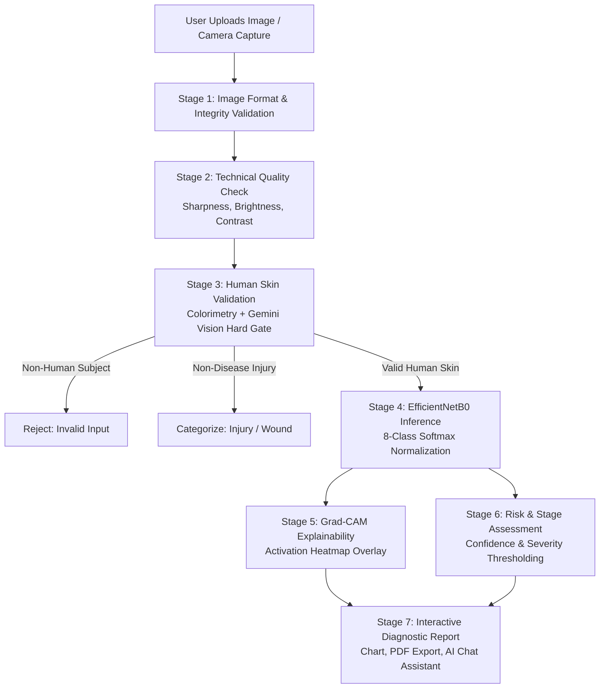

# 🔬 SkinAI — Skin Disease Classification & Stage Identification System

<div align="center">

[](https://www.python.org/)
[](https://www.tensorflow.org/)
[](https://keras.io/)
[](https://flask.palletsprojects.com/)
[](https://opencv.org/)
[](https://ai.google.dev/)
[]()
[]()

**An Intelligent Deep Learning & Multimodal Clinical Dermatology Analysis System**

[Explore Live Demo](http://127.0.0.1:5000) • [Report Bug](https://github.com/rishipandey28433-hash/Skin-disease-Detection/issues) • [Request Feature](https://github.com/rishipandey28433-hash/Skin-disease-Detection/issues)

</div>

---

> [!WARNING]
> **⚠️ Medical Disclaimer**: This application is an educational, research, and technical project developed as a final-year B.Tech capstone. It is **NOT** a certified medical diagnostic device. Always consult a qualified board-certified dermatologist for professional medical assessment, dermoscopic examination, or biopsy.

---

## 📌 Table of Contents

- [Overview](#-overview)
- [Key Features](#-key-features)
- [Multi-Stage Analysis Pipeline](#-multi-stage-analysis-pipeline)
- [Supported Disease Taxonomy](#-supported-disease-taxonomy)
- [System Architecture](#-system-architecture)
- [Tech Stack](#-tech-stack)
- [Project Directory Structure](#-project-directory-structure)
- [Quick Start & Installation](#-quick-start--installation)
- [Environment Configuration](#-environment-configuration)
- [API Documentation](#-api-documentation)
- [Explainable AI (Grad-CAM)](#-explainable-ai-grad-cam)
- [Deployment Guide](#-deployment-guide)
- [Author & Contact](#-author--contact)
- [License](#-license)

---

## 📖 Overview

**SkinAI** is an end-to-end clinical skin disease analysis system designed to classify dermatological lesions, estimate condition risk levels, generate visual heatmap explanations (Grad-CAM), and provide medical assistant interactions.

Built on transfer learning with **EfficientNetB0**, the system evaluates images through a 7-stage pipeline that validates technical image quality, performs human skin screening, detects lesions across 8 distinct diagnostic categories, and produces instant downloadable PDF reports.

---

## ✨ Key Features

- 🎯 **High Accuracy Classification**: EfficientNetB0 backbone pre-trained on ImageNet and fine-tuned on the HAM10000 dermatoscopy dataset.
- 🛡️ **Multi-Stage Validation Pipeline**: Hard gates to filter out non-skin objects (animals, plants, objects) and low-quality/blurry captures.
- 🔍 **Explainable AI (XAI)**: Grad-CAM (Gradient-weighted Class Activation Mapping) overlays highlighting exact regions influencing the model's decision.
- 💬 **Intelligent AI Dermatology Assistant**: Real-time AI consultation powered by Google Gemini with an automated offline medical knowledge base fallback.
- 📊 **Interactive Diagnostic Dashboard**: Dynamic probability distribution charts (Chart.js), severity meters, and condition risk scores.
- 📄 **Instant PDF Medical Reports**: Automated clinical report generation via ReportLab.
- 🔊 **Voice Speech Synthesis**: Browser-native text-to-speech reading out diagnosis summaries.
- 🔐 **User Authentication**: Secure session-based authentication backed by SQLite with salted password hashing.
- 🚀 **Production-Ready**: Configured for instant deployment on Render, Heroku, Railway, or AWS via Gunicorn.

---

## 🔄 Multi-Stage Analysis Pipeline



---

## 🧬 Supported Disease Taxonomy

The system classifies skin lesions into 8 primary categories plus healthy skin:

| Class ID | Medical Condition | Classification Category | Clinical Risk Level |
|---|---|---|:---:|
| `mel` | **Melanoma** | Malignant Neoplasm | 🔴 **High** |
| `bcc` | **Basal Cell Carcinoma** | Malignant Neoplasm | 🔴 **High** |
| `akiec` | **Actinic Keratoses / Intraepithelial Carcinoma** | Precancerous Neoplasm | 🟠 **Moderate** |
| `bkl` | **Benign Keratosis (Seborrheic Keratosis / Solar Lentigo)** | Benign Neoplasm | 🟢 **Low** |
| `df` | **Dermatofibroma** | Benign Neoplasm | 🟢 **Low** |
| `nv` | **Melanocytic Nevus (Common Mole)** | Benign Neoplasm | 🟢 **Low** |
| `vasc` | **Vascular Lesion (Angioma / Hemangioma)** | Vascular Abnormality | 🟢 **Low** |
| `vitiligo` | **Vitiligo** | Pigmentation Disorder | 🟢 **Low** |
| `healthy` | **Healthy Skin** | Normal Dermatology | ⚪ **None** |

---

## 🛠️ Tech Stack

### Core Technologies
- **Backend**: Python 3.11, Flask 3.0+
- **Deep Learning**: TensorFlow 2.16+, Keras (EfficientNetB0)
- **Computer Vision & XAI**: OpenCV, NumPy, Pillow, Matplotlib
- **Multimodal AI**: Google Gemini API (`google-genai`)
- **Database & Auth**: SQLite3, Werkzeug Security
- **Frontend**: HTML5, CSS3 Modern Flex/Grid, JavaScript ES6+, Chart.js, FontAwesome
- **PDF Generation**: ReportLab
- **WSGI / Production**: Gunicorn

---

## 📂 Project Directory Structure

```
Skin-Disease-Detection/
├── app.py                      # Flask application entry point & API routes
├── config.py                   # Global application configuration & paths
├── dataset_config.py           # Medical taxonomy, descriptions, symptoms & risks
├── model.py                    # EfficientNetB0 architecture & fine-tuning builder
├── pipeline.py                 # Multi-stage prediction & validation pipeline
├── predict.py                  # Standalone inference module
├── prepare_dataset.py          # Dataset splitting & stratification utility
├── train.py                    # Model training & transfer learning pipeline
├── continue_train.py           # Incremental training & checkpoint fine-tuning
├── requirements.txt            # Python dependencies
├── Procfile                    # WSGI deployment process definition
├── render.yaml                 # Render cloud deployment blueprint
├── .env.example                # Environment variable template
├── .gitignore                  # Git tracking rules & exclusions
├── models/
│   ├── skin_model.keras        # Trained EfficientNetB0 model weights (18.5 MB)
│   └── class_names.json        # Class label mapping
├── static/
│   ├── css/
│   │   └── style.css           # Responsive modern styling
│   ├── js/
│   │   └── script.js          # Interactive frontend & camera handlers
│   └── images/                 # UI assets & logos
├── templates/
│   ├── index.html              # Landing page & image upload portal
│   ├── result.html             # Detailed diagnostic report & AI chat
│   ├── login.html              # User authentication screen
│   ├── 404.html                # Custom 404 error template
│   └── 500.html                # Custom 500 error template
├── tests/
│   ├── test_api.py             # Route, auth, and API endpoint test suite
│   └── test_pipeline.py        # Image validation & pipeline unit tests
└── utils/
    ├── gemini.py               # Gemini multimodal integration & local fallback
    ├── gradcam.py              # Grad-CAM heatmap visualization engine
    ├── helper.py               # File validation & formatting helpers
    ├── image_validator.py      # Technical sharpness & blur quality checks
    └── preprocess.py           # 224x224 RGB image normalization
```

---

## 🚀 Quick Start & Installation

### 1. Clone the Repository
```bash
git clone https://github.com/rishipandey28433-hash/Skin-disease-Detection.git
cd Skin-disease-Detection
```

### 2. Set Up Virtual Environment (Recommended)
```bash
# Windows
python -m venv venv
venv\Scripts\activate

# Linux / macOS
python3 -m venv venv
source venv/bin/activate
```

### 3. Install Dependencies
```bash
pip install -r requirements.txt
```

### 4. Configure Environment Variables
Copy `.env.example` to create your local `.env` file:
```bash
cp .env.example .env
```
Edit `.env` to add your optional Gemini API Key:
```env
FLASK_SECRET_KEY=your_random_secret_key_here
SKINAI_USERNAME=admin
SKINAI_PASSWORD=admin123
GEMINI_API_KEY=your_google_gemini_api_key_here
```

### 5. Run the Application
```bash
python app.py
```
Open your browser and navigate to:
```
http://localhost:5000
```
> **Default Admin Credentials**:
> * **Username**: `admin`
> * **Password**: `admin123`

---

## 🧪 Running Automated Tests

Run the complete test suite:
```bash
python -m unittest discover tests
```
*Expected Output:*
```text
Ran 19 tests in 1.25s
OK
```

---

## 🔌 API Documentation

| Method | Endpoint | Description | Auth Required |
|:---:|:---|:---|:---:|
| `GET` | `/health` | Server health & timestamp check | No |
| `GET` | `/login` | Render login authentication page | No |
| `POST` | `/login` | Authenticate user session | No |
| `GET` | `/logout` | Clear user session | Yes |
| `GET` | `/` or `/home` | Main dashboard & upload portal | Yes |
| `POST` | `/predict` | Multipart upload for multi-stage analysis | Yes |
| `POST` | `/chat` | Interactive AI dermatology assistant consultation | Yes |
| `POST` | `/download_report` | Generate and download clinical PDF report | Yes |

---

## 📊 Explainable AI (Grad-CAM)

To provide transparency and clinical explainability, the system uses **Gradient-weighted Class Activation Mapping (Grad-CAM)**:

1. Computes gradients of the top predicted class score with respect to the feature map activations of the final convolutional layer (`top_conv` in EfficientNetB0).
2. Performs global average pooling over the gradients to determine importance weights.
3. Generates a 2D heatmap highlighting pixels with high predictive influence.
4. Overlays a JET colormap on the original dermatoscopy image for clinician review.

---

## ☁️ Deployment Guide

### Deploy on Render
1. Create a new **Web Service** on [Render.com](https://render.com).
2. Connect your GitHub repository: `rishipandey28433-hash/Skin-disease-Detection`.
3. Set the following parameters:
   * **Runtime**: `Python`
   * **Build Command**: `pip install -r requirements.txt`
   * **Start Command**: `gunicorn app:app --timeout 120 --workers 1 --threads 4`
4. Add Environment Variables:
   * `FLASK_SECRET_KEY`: *(Generate a secure random string)*
   * `GEMINI_API_KEY`: *(Your Google AI Studio API key)*

---

## 👨‍💻 Author & Contact

**Rishi Pandey**  
*Final Year B.Tech Project*

- 📱 **Mobile**: [+91 7905219674](tel:+917905219674)
- 📧 **Email**: [rishipandey7909@gmail.com](mailto:rishipandey7909@gmail.com)
- 🐙 **GitHub**: [@rishipandey28433-hash](https://github.com/rishipandey28433-hash)
- 📂 **Project Repository**: [Skin-disease-Detection](https://github.com/rishipandey28433-hash/Skin-disease-Detection)

---

## 📜 License

This project is licensed under the **MIT License** — see the [LICENSE](LICENSE) file for details.

---

<div align="center">
Made with ❤️ by <b>Rishi Pandey</b>
</div>

